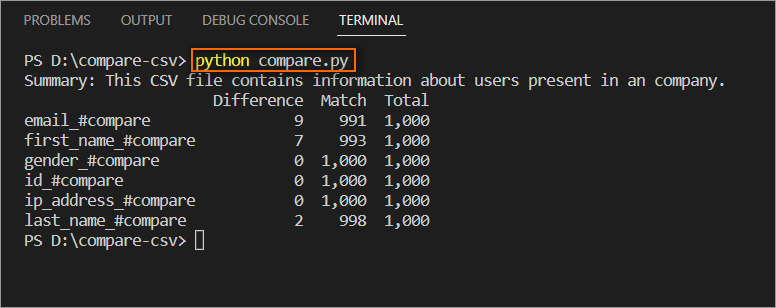
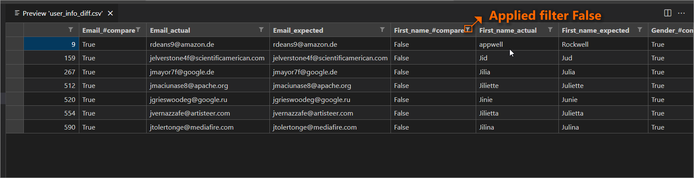

# Compare two CSV files using python

## Folder structure
    1.data/input.json --> contains necessary information about summary info, actual, expected diff file path and merge identity.
    2.inputs/actual/{{dynamic.json}} --> here {{dynamic}} represent any name contains the actual CSV file.
    3.inputs/expected/{{dynamic.json}} --> here {{dynamic}} represent any name contains the expected CSV file.
    4.inputs/diff/{{dynamic.json}} --> here {{dynamic}} represent any name, the file will be generated once the util is run.

# Prerequisite

    Install python using the link - [Download](https://www.python.org/downloads/windows/)

    using python run the below command to install the pandas library.
    ``` 
    pip install -r packages.txt 
    ```

# Run   

    To run the util run the below in the command prompt or powershell

    ```batch
    python compare.py
    ```

# Result snap

